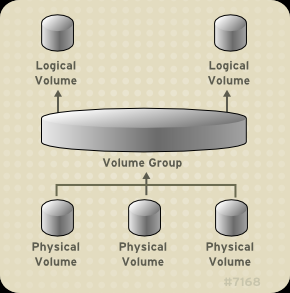

[toc]

# 逻辑卷

## 产生的原因
标准分区无法进行扩缩容(实际上逻辑卷的扩缩容也依赖于具体格式化成什么文件系统，不过一般支持扩容操作)

## 基础概念

* PV(physical volume)：物理卷在逻辑卷管理系统最底层，可为整个物理硬盘或实际物理硬盘上的分区。
* VG(volume group)：卷组建立在物理卷上，一卷组中至少要包括一物理卷，卷组建立后可动态的添加卷到卷组中，一个逻辑卷管理系统工程中可有多个卷组。
* LV(logical volume)：逻辑卷建立在卷组基础上，卷组中未分配空间可用于建立新的逻辑卷，逻辑卷建立后可以动态扩展和缩小空间。
* PE(physical extent)：物理区域是物理卷中可用于分配的最小存储单元，物理区域大小在建立卷组时指定，一旦确定不能更改，同一卷组所有物理卷的物理区域大小需一致，新的pv加入到vg后，pe的大小自动更改为vg中定义的pe大小。
* LE(logical extent)：逻辑区域是逻辑卷中可用于分配的最小存储单元，逻辑区域的大小取决于逻辑卷所在卷组中的物理区域的大小。

逻辑卷使用示意图

要使用 **lv** 需要先把 **pv** 加入到 **vg** 在从 **vg** 中创建 **lv**

## 基础命令
### pv-物理卷相关
#### 查看物理卷
* 查看简单信息
`pvs`
* 查看详细信息
`pvdisplay`

#### 创建物理卷
第二块硬盘的编号5的分区声明为物理卷
`pvcreate /dev/sdb5`
> 也可以直接把整个硬盘加入物理卷

#### 删除物理卷
`pvremove /dev/sdb5`
> 如果 pv 已经被使用则无法删除，需要依赖 lsof\dmsetup 等命令 找到使用的进程，合理结束进程再进行删除

### vg-卷组相关
#### 查看卷组
* 简单信息
`vgs`
* 详细信息
`vgdisplay`

#### 创建卷组
用sdb5创建vg2
`vgcreate vg2 /dev/sdb5`

> vg 的创建也能对一些参数进行设置
> * -s 对PE进行设置  vgcreate vg2 /dev/sdb5 -s 2M

#### 删除卷组
`vgremove vg2`
> 如果 vg 上有 lv 在使用则无法删除

#### 扩容卷组
`vgextend vg2 /dev/sdb6`

### lv-逻辑卷相关
#### 查看逻辑卷
* 简单信息
  `lvs`
* 详细信息
  `lvdisplay`

#### 创建逻辑卷
用vg2创建lv1
`lvcreate -n lv1 --size 1G vg2`

> 创建成功后能在 /dev/vg-name/lv-name 下看到对应的设备软链接

#### 删除逻辑卷
`lvremove  /dev/vg2/lv1`

#### 扩容逻辑卷
将 vg2 下面的 lv1 扩容到 300M

`vgextend /dev/vg2/lv1 -L 300M`

将 vg2 下的所有的未分配空间扩容到 lv1 

`vgextend -l +100%FREE /dev/vg2/lv1`

> 扩容之后只是块设备增长了，实际的文件系统不会自动识别多出来的部分，需要使用对应文件系统的扩容命令进行文件系统的扩容
> * ext4 `resize2fs` 
> * xfs `xfx_growfs` 
> 
> 部分 centos 版本 可能只能在扩容命令后面接挂载点，如果块设备不行可以改用挂载点试下

