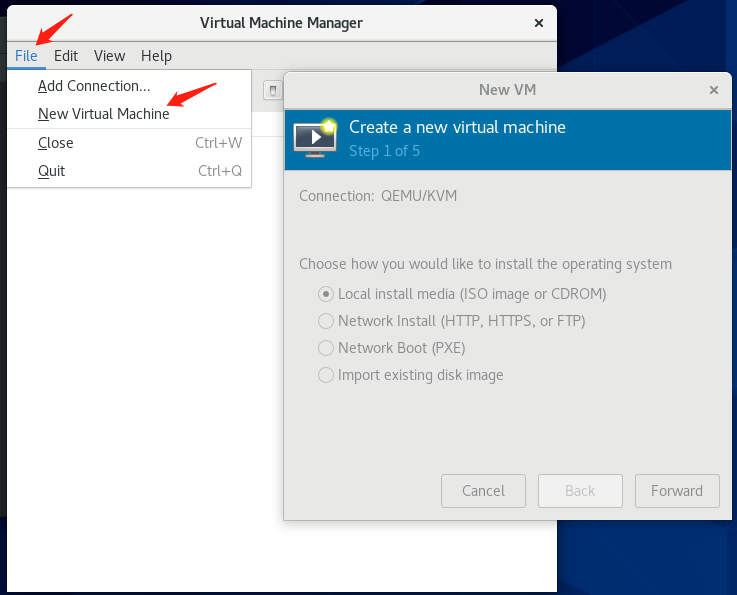
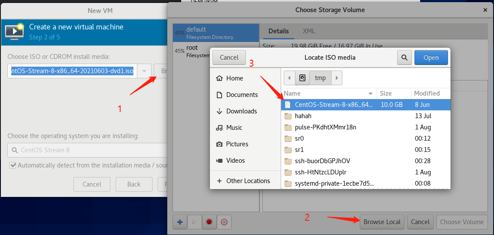

[toc]


# 虚拟化的概述
## 什么是虚拟化
RHEL 8 提供虚拟化功能，它让运行 RHEL 8 的机器能够托管（host） 多个虚拟机（VM），也称为客户机（guest）。VM 使用主机的物理硬件和计算资源，在主机操作系统中作为用户空间进程运行一个独立的虚拟操作系统（客户机操作系统）。

换句话说，虚拟化功能使在一个操作系统中执行其他操作系统成为可能。

# 软件安装
## 软件包安装
懒人安装方法 
`yum install -y virt*`

> 红帽教程中的安装方法为
> * yum module install virt
> * yum install virt-install virt-viewer

## 启用 libvirtd 服务
`systemctl start libvirtd`

> 主要是对虚拟化平台进行一个管理，libvirtd 可以管理大多数市面上的虚拟化平台

## 检查系统已准备好成为虚拟化主机
`virt-host-validate`

不能出现一个 fail 项, warn 项则一般无所谓，毕竟程序员看不见 warn 。


# 图形操作
调出单个主机

调出控制台
```bash
virt-manager
```
选择 File -> New Virtual Machine 打开创建新虚拟机向导


按下图1->2->3的顺序选择引导镜像


然后一直下一步就好了。

# shell 操作
```bash
virt-install --name centos --memory 1024 --disk path=/var/kvm/images/centos.img,size=10 --cdrom /tmp/CentOS-Stream-8-x86_64-20210603-dvd1.iso
```
> 其中 memory, disk volume size ,和指定一个带启动镜像的路径(也可以是别的启动方式)是必须的

查看全部主机
```bash
virsh list
```

查看单个主机
```bash
virt-viewer guest-name
```

关闭单个主机
```bash
virsh shutdown id
```
> id 是 `virsh list` 时候展示的id

拔电源操作
```bash
virsh destroy guest-name
```
> 等价于直接杀进程