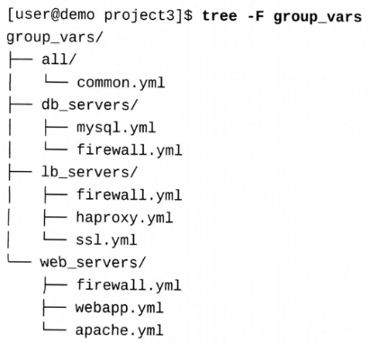

# 高效使用 Ansible 的方法
* Keep Things Simple(保持事物的简单)
  * 保持 playbook 的可读性
    * 使用注释保持可读性
    * 大面积使用对齐的空格和注释
    * 复杂配置使用 j2 模板
    * 使用 yaml 原生语法，不要使用折叠式(folded)的写法
  * 使用现有模块
    * ansible 自带模块，一般具有幂等性
  * 传承 **一种标准** 的代码风格

* Stay Organized(保持项目是有组织的)
  * 保持变量名称的命名风格
    * 扁平的命名空间，能一眼看出变量的作用。例如，apache_tls_port 等
    * role 或 group 中的变量带上 role 或 group 的名字前缀
  * 标准化项目目录结构
    * 区分细化各种 playbook 的功能
  * 使用动态的 inventory
    * 目前各种云平台都有提供动态 inventory 的功能
  * 使用 分组(inventory) 的优势
    * 注意 host 会继承 组变量，重复时会使用最后一个加载的变量
  * 使用 role 来重用你的代码
  * 在中心节点上运行 ansible-playbook

* Test Often(经常测试)
  * 测试 task 的结果
  * 使用 Block/Rescue 来回复或者回滚
  * 尽量用最新版本的 ansible 开发 playbook
  * 使用测试工具
    * --check or --syntax-check
    * ansible-lint 

# 管理 inventory

## inventory 插件介绍
每种 inventory 格式的支持都是通过插件的形式实现的，激活插件的位置在 ansible.cfg 的 inventory 块下的 enable_plugins 指令。

常用插件有如下几种
* host_list
* script
* auto
* yaml
* ini
* toml


## yaml 格式的 inventory
一个典型的 yaml 格式的 inventory 如下所示。

```yaml
workstation:
  hosts:
    host1.example.com:
    host2.example.com: # 这里的主机名不一定是真是的主机名，可以是别名, 然后在 ansible_host 变量中指定真实的主机名
      key1: value2
    host3.example.com:
  vars:
    key2: value2
```

yaml 格式可以以嵌套的形式来一层一层的定义组和主机，也可以使用扁平的形式来定义组和主机。

其中也包含了一些特殊的组名  all (表示所有的主机) 和 ungrouped (表示没有分组的主机)。

不同格式的配置可以通过 ansible-inventory 命令来进行转换和查看，所以这里就不介绍其它命令了。

下面的 demo 把一个 ini 格式的 inventory 转换成 yaml 格式的 inventory。

```shell
ansible-inventory --yaml -i inventory --list --output inventory.yaml
```

> TIPS: 需要注意一下，转换之后的结果虽然等价，但是写法可能不一定是最优的,且一定不要在有定义变量的 ini 格式 inventory, 转换后还继续编辑，除非你完全理解你在做什么。 

## yaml 排障

**冒号后面跟着空格**
```yaml
title: Ansible: Best Practices # the second colon produces a error
file: Not:a:problem # No space after the colon means no special treatment
simple: 'Quoting the value with the : character solve this problem'
double: "Double quotes also work with the : but permit escaped characters like \n"
```

**变量作为一个值的开始**

ansible 会把以 `{{ variable }}` 开头的值当做变量，但是任何以 { 开头的值在 yaml 中都会解析为对象，所以需要双引号把开头带变量的值引用起来。 foo: "{{ variable }} rest of the value"

通常来说，当使用下面任何一个字符时都需要使用双引号引用起来。

[] {} > | * & ! % # \ @ ,

**明白字符串和布尔、浮点的差别**

```yaml
active: yes # this is a boolean
active_str: "yes" # this is a string
```
```yaml
temperature: 36.5 # this is a float
version: "2.0" # this is a string
```


## 管理 inventory 变量
变量可以让项目重用且更灵活，可以在下面的位置定义变量
1. 在 role defaults 和 vars 中描述变量
2. 在 inventory 中可以定义 主机变量和主机组变量
3. 在 playbook 或者 inventory 下的 group_vars 或者 host_vars 子目录中的变量文件
4. 在 playbook、role 或 task 中

原则:
1. 保持简单
   1. 尽可能只在少数几个地方定义变量
2. 不要重复自身
   1. 不要重复定义相同的变量
3. 在一个较小、可读的文件中组织变量
   1. 比如 group_vars 目录下定义 web_server 目录下定义 firewall.yaml 定义所有关于防火墙相关的变量

### 变量的优先级和合并
从低到高如下:

1. 命令行参数
   1. 命令行的参数会覆盖配置文件中的参数
   2. 命令行中的参数除了 -e 指定的变量，拥有最高的优先级，其它的优先级都是最低的，比如 -u 指定 用户
2. role defaults 变量
   1. 在 rolename/defaults 中设置的变量值
3. 主机和主机组变量
   1. 可以在多个位置设置
      1. inventory 或者动态 inventory 中定义的 主机组 变量
      2. all 主机组在 inventory 的 group_vars/all 中定义的变量
      3. all 主机组在 playbook 的 group_vars/all 中定义的变量
      4. 自定义 主机组在 inventory 的 group_vars/all 中定义的变量
      5. 自定义 主机组在 playbook 的 group_vars/all 中定义的变量
      6. inventory 或者动态 inventory 中定义的 主机 变量
      7. inventory host_vars 子目录下的 主机 变量
      8. playbook host_vars 子目录下的 主机 变量
      9. facts 变量或者缓存的 facts 变量
4. play 下的变量
   1. play 下的 vars 部分
   2. vars_prompt 部分
   3. vars_files 部分
   4. rolename/vars 部分
   5. 当前 block 下的 vars 部分
   6. 当前 task 下的 vars 部分
   7. 使用 include_vars 动态加载
   8. set_fact 模块 或者 register 记录的 针对 特定主机的变量
   9. include_role 的 vars 部分
   10. include_tasks 的 vars 部分
5. 额外变量 (extra vars)
   1. 命令行中使用 -e 指定的变量 

### 从 inventory 中分离变量
比较好的一个分离结果如下，按照主机组分离变量，然后在 playbook 中引用。



### 特殊的 inventory 变量
* ansible_connection: 连接方式
  * ssh
  * local
* ansible_host: 实际ip 或者 全限定主机名，ansible 实际连接的主机
* ansible_port: 实际连接的端口
* ansible_user: ansible 在没配置的情况下，默认使用运行 playbook 当前用户，指定之后会使用该用户连接
* ansible_become_user: 提权用户，可以使用 ansible_become_method 指定提权方式
* ansible_python_interpreter: python 解释器路径

> inventory_hostname: ansible 中的主机名
> ansible_host: 实际连接的主机名或者 ip
> ansible_facts['hostname']: ansible 收集的主机名，非全限定名
> ansible_facts['fqdn']: ansible 收集的全限定主机名


# 管理 task 执行
## 授权策略
task 中提权
```yaml
---
- name: Play with become
  hosts: all
  become: false
  tasks:
    - name: Run a command as root
      command: whoami
      become: true # 对这个 task 进行了提权
```

blocks 中提权
```yaml
---
- name: Play with block escapsolation
  hosts: all
  become: false
  tasks:
    - block:
        - name: Run a command as root
          command: whoami
          register: result
        - name: Run a command as root
          command: whoami
          when: result.stdout == 'root'
      become: true # task in this block escalation
```

role 提权
```yaml
---
- name: Example play with one role
  hosts: all
  roles:
    - role: role-name
      become: true # role escalation
```

配置文件或者连接参数提权

| configuration 或者 playbook 指令 | connection variable   |
|------------------------------|-----------------------|
| become                       | ansible_become        |
| become_method                | ansible_become_method |
| become_user                  | ansible_become_user   |
| become_password              | ansible_become_pass   |


## 控制执行顺序
在 play 里面 ansible 总是从 roles 开始执行，然后是 tasks，最后是 handlers。

所以写的时候也最好按照上面的顺序来写。

### importing 或者 including roles 作为一个 task
这种方法的优点是可以在一个 play 中指定 task 和 role 的运行顺序，缺点是可能让 使用了哪些 role 变得不太直观

import_role 静态导入,开始执行之前先导入 role 的内容，如果 role 有语法错误并不会执行
include_role 动态导入，执行到这个task的时候才会导入 role 的内容，如果 role 有报错会退出 playbook, 一般有条件判断时使用

```yaml
- name: Executing a role as a task
  hosts: all
  tasks:
    - name: a normal task
      debug:
        msg: 'first task'
    - name: Include a role
      include_role:
        name: role-name


```

### 定义 pre 和 post task
pre_tasks 会在  roles 之前执行
post_tasks 会在 tasks 和由 tasks 通知的 handlers 之后运行

整个 playbook 的执行顺序会按如下顺序执行

1. pre_tasks
2. pre_tasks 通知的 handlers
3. roles
4. tasks
5. tasks 通知的 handlers
6. post_tasks
7. post_tasks 通知的 handlers

一个阶段多次通知 handlers，handlers 只会执行一次，但不同阶段通知的 handlers 会执行多次。

也可以在某一阶段的 tasks 指定位置执行之前已经通知的所有 handlers, 只需加入一个特殊的 meta 模块
    
```yaml
- name: Executing a role as a task
  hosts: all
  tasks:
    - name: a normal task
      debug:
        msg: 'first task'
      changed_when: true # 触发handlers
      notify: xx_handler
    - name: Include a role
      meta: flush_handlers # 执行之前通知的所有 handlers

```

### 监听 handlers
除了直接通知 tasks , 一个 handler 也可以订阅一个 notification. 这样就可以一个通知通知多个 handlers 了.

```yaml
- name: Executing a role as a task
  hosts: all
  tasks:
    - name: a normal task
      debug:
        msg: 'first task'
      changed_when: true # 触发handlers
      notify: xx_handler
    - name: Include a role
      meta: flush_handlers # 执行之前通知的所有 handlers
  handlers:
    - name: xx_handler
      debug:
        msg: 'xx handler'
    - name: yy_handler # 这里也会被触发
      debug:
        msg: 'yy handler'
      listen: xx_handler # yy_handler 订阅 xx_handler 的通知
```

使用场景:
role 中如果使用了 handlers ，如果 role 发出了 notification ,其它地方的handler 只要监听了这个 notification,也会执行。

一般建议使用 listen ，避免因为 notification 的名字冲突导致的问题，也可以避免修改 handler name 属性，导致的过多地方需要修改。

### 控制主机的执行顺序

play 下有一个 order 属性，可以控制主机的执行顺序,有效值为:

* inventory, 默认值，按照 inventory 中的顺序执行
* reverse_inventory, 按照 inventory 中的顺序倒序执行
* sorted, 按照主机名排序
* reverse_sorted, 按照主机名倒序
* shuffle, 随机执行

```yaml
- name: Testing host order
  hosts: web_servers
  order: sorted
  tasks:
    - name: Creating a test file in /tmp
      copy:
        content: 'This is a sample file'
        dest: /tmp/testfile
```

> 因为 ansible 是可控制执行的并发度，所以这个顺序只是在一个 play 中的主机执行顺序，不是 ansible-playbook 命令执行结果的实际响应顺序。


## 执行指定的 tasks

### 标记 ansible 资源
tags 属性，在以下资源中可以使用

* task
* block
* role
* play

### 管理 被标记过的资源
以下是相关命令行参数
* --list-tags, 列出所有标记过的资源
* --tags 指定运行包含相应 tag 的资源
* --skip-tags 指定跳过运行包含相应 tag 的资源

### 特殊的 tags

always 总是会执行，除非使用了 --skip-tags always
never 从不执行，除非使用了 --tags never

tagged 所有被标记过的资源
untagged 所有没有被标记过的资源
all 所有资源

## 优化执行速度

### 针对基础设施的优化
使用最新版本的 ansible 一般会有更好的性能。特别是最新版本的核心模块，ansible 团队一直在优化这些模块的性能。
控制节点离被控制节点尽可能"近"一点，节点间的带宽越大越好，这样可以减少传输时间。

### 禁止 fact 变量收集
一些 playbook 经常使用的变量，可以使用替换的思想，比如  ansible_fact['hostname'], ansible_hostname,ansible_facts['nodename], ansible_nodename 这些变量经常用来指向当前运行的主机，其实可以使用 inventory_host_name 或者 inventory_hostname_short 来替换，就不需要进行 fact 变量的收集。

手工指定在哪些 task 执行之前通过 setup 模块收集，从而按需收集。

### 增加 parallelism
通过forks 参数来控制并发度，可以在 ansible.cfg 中设置默认值，也可以在命令行中指定 -f ，命令行指定的优先级更高。

ansible.cfg
```ini
[defaults]
inventory=inventory
remote_user=ansible
forks=100
```
### 避免软件包管理模块使用循环
一些模块接受列表作为工作参数，不需要使用循环，比如 yum, apt, dnf, pip 等模块，可以一次性传入多个包名，这样可以减少循环次数，提高效率。
但是有些模块不支持这种方式，比如 service, file, user 等模块，这些模块需要使用循环。

### 高效拷贝文件到被管理主机
copy 模块递归拷贝目录到被管理主机，当目录很大、有大量的文件时，拷贝会很慢，如果你多次执行 playbook , 下面的 拷贝模块会很快，因为他们只拷贝不相同的模块。
通常使用 synchronize 模块来拷贝大量文件到被管理主机。这个模块使用 **rsync** 来实现，所以在大多胡情况下比 copy 更快。

```yaml
- name: Deploy the web content on the web servers
  hosts: web_servers
  become: True
  gather_facts: False
  tasks:
    - name: Ensure web content is updated
      synchronize:
        src: web_content/
        dest: /var/www/html
```

### 使用模板
lineinfile 模块插入或者删除一行，当文件很大时，这个模块会很慢，可以使用 template 来替换。

### 优化 ssh 连接

ControlMaster
这个 SSH 指令，能让多个 ssh 连接重用第一个连接，绕过了缓慢的初始化过程，连接会在最后一个会话关闭后关闭。

ControlPersist
这个指令，能让ssh 连接保持打开状态，直到超时或者手动关闭。

```ini
[ssh_connection]
ssh_args = -o ControlMaster=auto -o ControlPersist=60s
```

### 开启 pipelining
ansible 需要把所有数据和模块都传递给远程主机来执行，这样会导致很多的网络传输，可以开启 pipelining 来减少网络传输。

```ini
[ssh_connection]
pipelining = True
```

ansible 默认没有使用 pipeline, 因为 requiretty sudo 选项在所有远程节点上都需要被禁用，红帽 rhel8 上默认禁用了 requiretty, 所以可以直接开启 pipeline.

### callback 插件
callback 插件可以在 playbook 执行过程中，输出一些信息，比如 playbook 开始执行，playbook 执行结束，playbook 执行失败等等，这些信息可以帮助我们更好的了解 playbook 的执行情况，可以根据这些信息来优化 playbook 的执行。
列如 timer 插件，可以输出每个 task 的执行时间，可以根据这些信息来优化 playbook 的执行。

# 使用过滤器和插件转换数据
使用 filter 可以格式化、转换、定义变量的值

## ansible filters

**变量类型**
Strings

```yaml
my_string: those are contents of the string
string with breaks: |
  This string 
  has serveral
  line breaks
string_without_breaks: >
  this string will not 
  contain any line breaks
  Separated lines are joined
  by a space character
```

Numbers
```yaml
answer: 42
float_answer: 42.0
scientific_answer: 0.42e+2
hex_answer: 0x2A
string_not_number: "20"
```

Booleans
大小写不敏感，可以使用
yes,no,n,on,off,true,false

Dates
```yaml
my_date_time: 2019-05-30T21:15:32+02:00
my_simple_date: 2019-05-30
```

Null
null 或者 ~

Lists of Arrays

```yaml
my_list: ['Douglas','Marvin','Arthur']
my_list2:
  - Douglas
  - Marvin
  - Arthur
```

Dictionaries
```yaml
my_dict: {Douglas: Human,Marvin: Robot, Arthur: Human}
my_dict2:
    Douglas: Human
    Marvin: Robot
    Arthur: Human
```

### 常用 filter 概述

mandatory
如果变量没有定义，就会报错

`{{ my_value | mandatory}}`

default
如果变量没有定义，就会使用默认值.
第二个参数，表示空字符串或者 Boolean 值为 False 时，也会使用默认值。

`{{ my_value | default(my_default,True) }}`

**算术运算 filters**

| operator | purpose |
|----------|---------|
| +        | 加      |
| -        | 减      |
| *        | 乘      |
| /        | 除      |
| //       | 整除    |
| %        | 取余    |
| **       | 乘方    |

**操作列表和字典**

combine
合并多个列表或者字典

dict2items
字典变成列表，这个会用的比较多，方便循环

items2dict
列表变成字典


查看列表属性:
    max    求最大值
    min    求最小值
    sum    求和
    length 获取长度
    first  获取第一个元素
    last   获取最后一个元素
    random 获取一个随机元素

修改列表元素排序:
    reverse 反序
    sort    排序
    
列表转为集合
    unique               唯一值
    union                合集
    intersect            交集
    difference           差集
    symmetric_difference 对称差集


**hash、encoding、操作字符串**

hash 字符串或者密码
    hash('some kind of hash name')             以某种方式 hash 某个字符串，比如 hash('sha1')
    password_hash('some kind of hash name')    密码hash，会比 hash 多一些参数，如加盐之类的
    
编码字符串
b64encode  base64编码
b64decode  base64解码

格式化文本
lower      小写
upper      大写
capitalize 首字母大写

替换文本

replace 替换字符
    replace('aa','bb') 替换 aa 成 bb

regex_search
    regex_search('regex') 按正则表达式搜索
regex_replace
    regex_replace('aa','bb') 按正则表达式替换


** 操作 json 数据 **
json_query
    json_query('[*].name') 按json查询指定变量

解析和编码数据结构
to_json
    解析和编码成 json 格式,还有一个to_nice_json
to_yaml
    解析和编码成 yaml 格式,还有一个to_nice_yaml

### 使用 lookups 模板化外部变量
这里的 lookups 主要是 jinja2 模板中的 lookup 和 query 两个模板函数，两个函数都和 filter 的使用非常像。 
lookup 插件可以从外部获取变量，比如从文件中获取变量。

file lookup 插件使用 demo 如下

```yaml
---
- hosts: localhost
  vars:
    hosts: "{{ lookup('file','/etc/hosts','/etc/issue') }}"
  tasks:
    - debug:
        var: hosts
```
结果为:
```shell
{
    "hosts": "127.0.0.1   localhost localhost.localdomain localhost4 localhost4.localdomain4\n::1         localhost localhost.localdomain localhost6 localhost6.localdomain6\n\n172.25.254.254\tclassroom.example.com classroom\n172.25.254.254\tcontent.example.com content\n172.25.254.254\tmaterials.example.com materials\n### rht-vm-hosts file listing the entries to be appended to /etc/hosts\n\n172.25.250.8    utility.lab.example.com utility git.lab.example.com git\n172.25.250.7    tower.lab.example.com tower\n172.25.250.10   servera.lab.example.com servera\n172.25.250.11   serverb.lab.example.com serverb\n172.25.250.12   serverc.lab.example.com serverc\n172.25.250.13   serverd.lab.example.com serverd\n172.25.250.14   servere.lab.example.com servere\n172.25.250.15   serverf.lab.example.com serverf\n172.25.250.254  bastion.lab.example.com bastion \n172.25.250.9    workstation.lab.example.com workstation,\\S\nKernel \\r on an \\m"
}
```
query 则会获取一个列表

```yaml
---
- hosts: localhost
  vars:
    hosts: "{{ query('file','/etc/hosts','/etc/issue') }}"
  tasks:
    - debug:
        var: hosts
```
输出如下
```shell
{
    "hosts": [
        "127.0.0.1   localhost localhost.localdomain localhost4 localhost4.localdomain4\n::1         localhost localhost.localdomain localhost6 localhost6.localdomain6\n\n172.25.254.254\tclassroom.example.com classroom\n172.25.254.254\tcontent.example.com content\n172.25.254.254\tmaterials.example.com materials\n### rht-vm-hosts file listing the entries to be appended to /etc/hosts\n\n172.25.250.8    utility.lab.example.com utility git.lab.example.com git\n172.25.250.7    tower.lab.example.com tower\n172.25.250.10   servera.lab.example.com servera\n172.25.250.11   serverb.lab.example.com serverb\n172.25.250.12   serverc.lab.example.com serverc\n172.25.250.13   serverd.lab.example.com serverd\n172.25.250.14   servere.lab.example.com servere\n172.25.250.15   serverf.lab.example.com serverf\n172.25.250.254  bastion.lab.example.com bastion \n172.25.250.9    workstation.lab.example.com workstation",
        "\\S\nKernel \\r on an \\m"
    ]
}
```

**获取命令行的输出**

`{{ query('pipe','ls files') }}`
`{{ query('lines','ls files') }}`
pipe 插件和 lines 插件都是在控制节点产生输出。
pipe 插件将所有输出作为一个字符串返回，lines 插件将输出作为一个列表返回。

`{{ lookup('url','http://www.example.com/myfile') }}`

url 插件可以从一个 url 中获取变量内容。

`{{ lookup('k8s',kind='Deployment',namespace='ns',resource_name='my_res') }}`
k8s 插件使用 openshift python client 获取 k8s 资源的信息。
必须提供 kind 信息和 其他对象详情信息来获取对象。 

`{{ lookup('file','/etc/motd') }}`
file 插件可以获取一个文件的内容，结合 from_yaml 和 from_json 可以获取一个 yaml 或者 json 文件的内容。

`{{ lookup('template','my.template.j2') }}`
template 插件可以将一个 jinja2 模板文件渲染成一个字符串返回。也可以加上 convert_data 将 yaml 格式的字符串当做变量来处理。
template 也可以定义起始和终止标记序列(用来标记那一段话是由ansible处理的不要随意修改)，比如:

`{{ lookup('template','my.template.j2',convert_data=False,startline='#<%',endline='%>#') }}`

`{{ lookup('env','MY_PASSWORD') }}`
用 env 插件可以查询控制节点的环境变量。


**查看 lookup 插件的帮助信息**

`ansible-doc -t lookup -l`  列出所有插件类型
`ansible-doc -t lookup file` 列出 file 插件的帮助信息 


**处理 lookup 插件的错误**
ansible 中的报错会让程序停止执行，lookup 插件的报错可能不一定需要停止整个程序，比如 file 插件如果没有找到某个文件的内容，可以使用下面的方式处理

```yaml
{{ lookup('file','my.file',errors='warn') | default('default value') }}
```

### 实现高级循环

嵌套列表的循环， loop 关键字不能直接 flatten 列表套列表，with_items 关键字可以自动解嵌套多层列表。
loop 要实现 flatten 的效果，可以使用 flatten filter.

```yaml
---
- name: loop with item
  hosts: localhost
  vars:
    list1:
    - list1-f1
    - list1-f2
    list2:
    - list2-f1
    - list2-f2
    list3:
    - "{{ list2 }}"
    - list3-f2
    list4:
    - "{{list1}}"
    - "{{list3}}"
  tasks:
  - debug:
      msg: "{{ item }}"
    with_items:
    - "{{ list1 }}"
    - "{{ list2 }}"

  - debug:
      msg: "{{ item }}"
    loop:
    - "{{ list1 }}"
    - "{{ list2 }}"

  - debug:
      msg: "{{ item }}"
    #loop: "{{ list3 | flatten }}"
    loop: "{{ list3 | flatten(levels=1) }}"
```

可以使用 subelements 来循环嵌套列表，但是 subelements 会将列表展开，并带上原有变量 raw，循环的元素变成 [raw,subelement]

```yaml
- name: subelements filter
  hosts: servera.lab.example.com
  vars:
    users:
    - name: gzy1
      group:
      - group1
      - group2
    - name: gzy2 
      group:
      - group3
      - group4
    tasks:	
      - name: create some group
        group:
          name: "{{ item.1 }}" #创建组名
        state: present
        loop: "{{ users | subelements('group') }}"
      - name: create user with some groups 
        user:
          name: "{{ itern.0.name }}"
          groups: "({ item.1 }}"
          append: yes
        loop: "{{ users | subelements('group') }}"
```

**dict迭代**
定义字典结构
```yaml
users:
  demo1:
    name: Dome User 1
    mail: demo1@example.com
  demo2:
    name: Dome User 2
    mail: demo2@example.com
# ...
  demo200:
    name: Demo User 200
    mail: demo200@example.com
```

使用字典结构
```yaml
- name: Iterate over Users
  user:
    name: "{{ item.key }}"
    comment: "{{ item.value.name }}"
    state: present
  with_dict: "{{ users}}"
```

**file globbing pattern匹配**
使用 fileglob  lookup 插件可以匹配文件，返回一个列表，列表中的元素是匹配到的文件名。
```yaml
- name: Find all files in /etc that end in .conf
  debug:
    msg: "{{ item }}"
  loop: "{{ lookup('fileglob', '/etc/*.conf') }}"
```

### 处理网络信息
**收集信息**
可以通过声明一个 setup 模块，来指定只收集哪些 facts 变量信息

```yaml
- name: collect network facts only
  setup:
    gather_subset:
      - !all
      - network
```

**ipaddr filter**
ipaddr filter 可以检查 ip 地址 和操作ip , 子网计算， 找到下一个在网络中可用的 ip 地址等等。

```yaml
- hosts: localhost
  vars:
    addr: 1.1.1.1/24
    addr1: 1.1.1.0/24
    addr2: 1.1.1.128/25
  tasks:
  - debug:
      msg: "{{ addr | ipaddr }}"
  - debug:
      msg: "{{ addr | ipaddr('netmask') }}"
  - debug:
      msg: "{{ addr | ipaddr('address') }}"
  - debug:
      msg: "{{ addr | ipaddr('net') }}"
  - debug:
      msg: "{{ addr1 | ipaddr('net') }}"
  - debug:
      msg: "{{ addr | ipaddr('host') }}"
  - debug:
      msg: "{{ addr | ipaddr('prefix') }}"
  - debug:
      msg: "{{ addr | ipaddr('host/prefix') }}"
  - debug:
      msg: "{{ addr | ipaddr('network/prefix') }}"
  - debug:
      msg: "{{ addr | ipaddr('public') }}"
  - debug:
      msg: "{{ addr | ipaddr('private') }}"
  - debug:
      msg: "{{ addr | ipaddr(10) }}"
```


**使用插件收集网络信息**
查询 www.ansible.com 的 DNS 信息
`{{ lookup('dig','www.ansible.com') }}`

增加一些参数，按类型查询 dns 信息
`{{ lookup('dig','www.ansible.com','qtype=MX') }}`
`{{ lookup('dig','www.ansible.com/MX') }}`

例子，检查一个地址是不是私网地址
```yaml
- name: ipaddr example
  hosts: lb_servers
  tasks:
    - name: Determinte if host's ip addr is private
      debug:
        msg: "{{ lookup('dig',ansible_facts['hostname'] | ipaddr('private'))}}"

```


# 配合滚动更新
## task 委派
关键字 delegate_to, 一般会使用 localhost 来执行被委派的任务，因为 localhost (控制节点) ,会有很多用来测试的软件，不过具体还是要看实际需求。

```yaml
---
- name: task delegate working
  hosts: servera.lab.example.com
  tasks:
  - command: uname -a
    register: servera
  - debug:
      var: servera

# 委派到 localhost
  - command: uname -a
    delegate_to: localhost
    register: local
  - debug:
      var: local
```


## facts 委派
delegate_facts 结合 delegate_to 可以实现把 facts 信息收集到控制节点上，然后在控制节点上使用 facts 信息。

```yaml
---
- name: facts delegate working
  hosts: localhost
  gather_facts: no
  tasks:
  - name: set a fact in deletegated task on servera
    set_facts:
      myfact: where am  I set?
  - name: display the facts from servera
    debug:
      msg: "{{ hostvars['servera.lab.example.com']['myfact'] }}"

```

## serial 参数
默认 ansible 会执行所有主机的同一个任务，如果一个 task 全都失败了，所有主机都会卡死在某一个 task 上，这可能表示此时没有主机可以正确运行。

**设置固定的批次大小**
每批次执行 2 个主机。
```yaml
- name: update webservers
  hosts: webservers
  serial: 2
# serial: 25% # 如果使用百分数会向下取整，舍入到0的时候最小1个
```

**设置变化的 serial**
第一次执行1个主机，第二次执行10%主机，第三次执行100%的主机
```shell
- name: update webservers
  hosts: webservers
  serial: 
  - 1
  - 10%
  - 100%
```

## play 异常退出
因为 ansible 维护了一个 ansible_play_batch 变量，每次有 task 执行失败，都会将相应的 主机 移除该变量，如果该变量为空，就会退出 play。

设置 serial 参数，可以避免全部主机都执行失败的额情况，限制每批次执行的主机数量，如果该批次全部失败了，就会退出 play。

这个主机的失败情况由 max_fail_percentage 参数控制，如果某个批次失败的主机数量超过了这个百分比，就会退出 play。

run_once 可以控制 task 某个批次只运行一次。如果需要整个 play 只运行一次，可以使用下面的代码

`when: inventory_hostname == ansible_play_hosts[0]`
